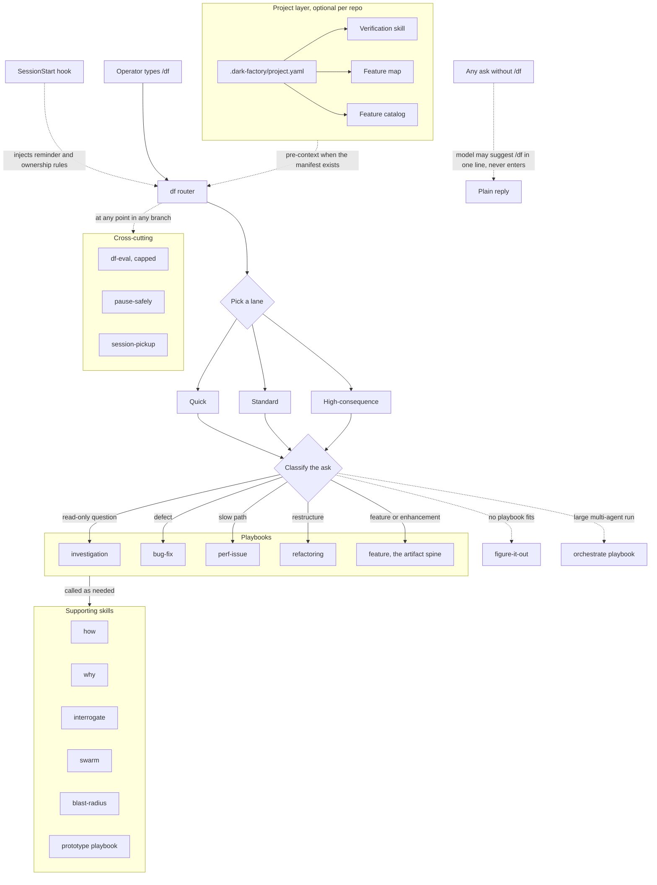
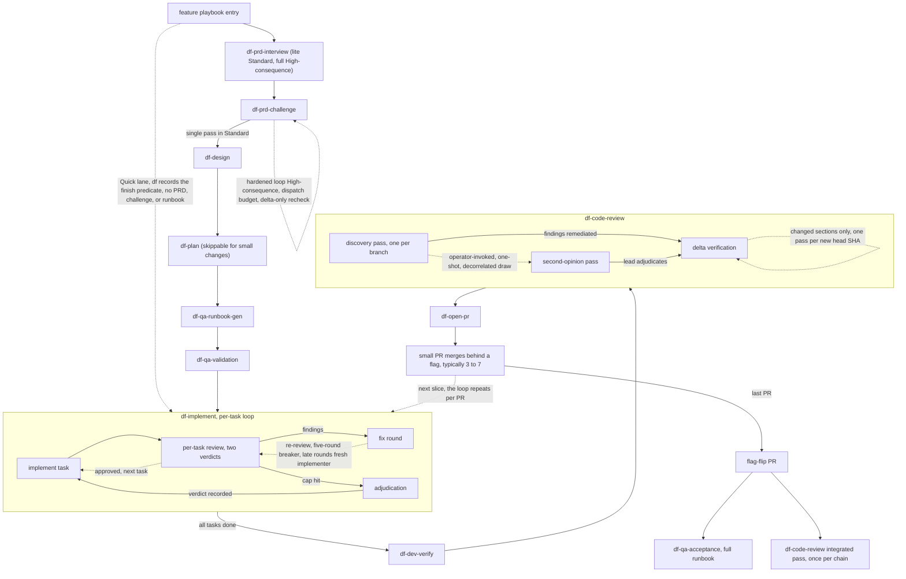

# dark-factory

A development workflow for coding agents, packaged as skills for
[Claude Code](https://docs.anthropic.com/en/docs/claude-code) and
[Codex CLI](https://github.com/openai/codex). One router, a set of playbooks,
and an artifact spine that takes a feature from requirements to merged PRs with
an executed acceptance runbook.

This repo holds workflow assets only. No application code lives here, and the
skills are project-agnostic.

## Background: what is a dark factory?

Borrowed from manufacturing, where robots work in unlit facilities because they
do not need to see. Applied to software: **specifications go in, tested software
comes out.** The human defines what should exist. Machines handle the rest.

The framing comes from
[Dan Shapiro's five levels of AI-assisted development](https://www.danshapiro.com/blog/2026/01/the-five-levels-from-spicy-autocomplete-to-the-software-factory/),
modeled after the NHTSA driving automation levels. See also:

- [Simon Willison, StrongDM Software Factory](https://simonwillison.net/2026/Feb/7/software-factory/)
- [Stanford Law, Built by Agents, Tested by Agents, Trusted by Whom?](https://law.stanford.edu/2026/02/08/built-by-agents-tested-by-agents-trusted-by-whom/)
- [Anthropic, 2026 Agentic Coding Trends Report](https://resources.anthropic.com/2026-agentic-coding-trends-report)

| Level | Name | Description |
|-------|------|-------------|
| 0 | Manual | Traditional development, no AI assistance |
| 1 | Task automation | AI writes tests, docs, boilerplate |
| 2 | Paired programming | Developer pairs with AI in the IDE |
| 3 | Human-in-loop management | AI acts as senior dev, human manages each step |
| 4 | Autonomous operation | Developer becomes PM, writes specs, AI handles the rest |
| 5 | Dark factory | Black box, specs in, tested software out |

### Where this lands today

Late level 3, early level 4, and the interesting constraint is no longer
capability. Frontier models will execute a review loop as faithfully as it is
written, which means a loop with no work-based budget and no falsifiable exit
runs until something external stops it. The v2 design treats that as the
problem to solve. Autonomy inside a run is high. The boundaries are deliberate,
and they are where the human stays.

Four things are still human by design:

- entering the mode, because a casual question should never start a pipeline
- confirming the lane, because ceremony has to be proportional to consequence
- the technical design checkpoint, because the PRD says what to build and how
  to build it still benefits from judgment
- merging, because the operator merges every PR and the agent never does

The framework is built so you can remove yourself from steps as trust builds,
rather than going fully autonomous on day one.

## How you use it

### Entry

The operator types `/df`. That is the only entry. The router never activates
itself, and a session may suggest `/df` in one line but never enters on its
own. Work done without `/df` is ordinary conversation.

A SessionStart hook keeps a one-line reminder and the ownership rules in
context. It does not activate the mode.

### Lanes

The router classifies the ask into a lane before any work, proposes it, and
records it in the run state. Nothing escalates itself silently.

| Lane | For | Shape |
|---|---|---|
| Quick | A bug fix, small UI change, or config change with a named surface and one acceptance target | Finish predicate recorded up front, no PRD, one reviewer, one PR |
| Standard | A typical feature whose requirements fit a small PRD | Lite PRD, single-pass challenge, thin runbook, several small PRs behind a flag |
| High-consequence | Credential or auth boundaries, migrations, protocol compatibility, anywhere wrongness is a security incident | Full PRD, written autonomy contract, hardened loop under a dispatch budget |

Every lane runs under a dispatch and wall-clock budget. Budget exhaustion is a
stop, not a flag.

### Playbooks

The router matches the task to a playbook and copies its steps into the todo
list verbatim, before any task-specific planning. A step you choose not to do
stays in the list with a written `skip: <reason>`. Skipping silently is not
allowed, because the measured failure mode is reading a playbook and then
writing a bespoke plan that quietly drops its steps.



## The feature spine

New or changed behavior routes into the feature playbook, which runs the
artifact spine end to end. Solid edges are forward flow. Dashed edges are
bounded loops and bypasses, and each loop label names its bound.



## Design rules

These are the constraints the skills are built around. They are the reason the
pipeline terminates.

**Review is a single pass with diverse reviewers and a lead who adjudicates.**
Not rounds. A Standard challenge is one Claude reviewer and one Codex reviewer
on the same prompt, one remediation wave, one delta verification. Acting on
more than five findings out of a review is a signal the lead is under-filtering,
not a sign of thoroughness.

**Budgets count work, not rounds.** A round cap with exemptions for
verifications, orphan adoptions and convergence extensions is not a cap. Every
dispatch reserves against the run's budget before it spawns, through
`scripts/df-state.sh`, so it is counted before it exists. Exhaustion stops the
run.

**Re-review is delta-scoped.** Once discovery has read the whole artifact, a
second discovery pass mostly re-reads work the loop itself created. What gets
re-read is the remediation and the code it touched. Five bounded re-review
forms survive, each with an explicit bound, and rerun-until-zero-findings is
not one of them.

**A finish condition has to be falsifiable.** A duration is not a finish
condition. Every run records a predicate that can be shown false.

**Growth stops hard.** An artifact that has doubled against its anchor stops
growing, and a loop that feeds on its own output terminates rather than
extending.

**Delivery is small PRs behind a feature flag**, typically three to seven,
merging as each goes green with a visible vertical slice first. Verified but
unlanded work counts as zero. The flag-flip PR is last and triggers the full
acceptance runbook plus one integrated review pass over the chain.

**Subagents inherit the session model by default.** The session model is the
operator's throttle. Pins exist only as cheap tiers for menial work and as
floors for recheck reviewers, and a pinned role never runs above the current
session model unless it is a designated floor. The per-role table is
`skills/df/references/model-policy.md`.

**Reviewers read a disposable worktree snapshot**, never the live tree. A
degraded sandbox must only ever touch a throwaway.

## Prerequisites

**Claude Code, Codex CLI, or both.** The two trees are peers. `skills/` is the
Claude source of truth and `codex-skills/` is the Codex-native tree. Shared
reference files are held byte-identical by `just check-parity`, with a short
allowlist for the files that carry sanctioned harness differences.

**tmux**, when Codex is the driver. Secondary Claude reviews run as interactive
Claude Code sessions inside tmux. The Codex flow does not use `claude -p`,
`--print`, SDK mode, or stdout piping.

**agent-browser**, for QA acceptance. Install
[agent-browser](https://github.com/vercel-labs/agent-browser) and put it on
your PATH.

**just**, for the commands below.

Superpowers is no longer a prerequisite. Earlier versions of this framework
required it as the implementation engine. The practices worth keeping were
ported into `df-implement`, `df-plan` and the playbooks, and the plugin was
removed from both harnesses. See the provenance section.

## What this repo contains

```
dark-factory/
  skills/                     # Claude Code skill source of truth
    df/                       # the router: lanes, playbook triggers, subagent rules
      playbooks/              # 16 playbooks, copied verbatim into the todo list
      references/             # principles, model policy, vendor manifest
    df-prd-interview/         # PRD authoring with quality gates
    df-prd-challenge/         # model-diverse PRD stress test, single pass by lane
    df-design/                # design alternatives and the rationale artifact
    df-plan/                  # checklist plans with a mutation-tested checker
    df-qa-runbook-gen/        # machine-generated QA runbook from the PRD
    df-qa-validation/         # multi-model PRD and runbook validation
    df-implement/             # per-task delegation with the review economy
    df-dev-verify/            # developer self-verification on the matching surface
    df-code-review/           # discovery pass plus delta verification
    df-qa-acceptance/         # runbook execution through agent-browser
    df-eval/                  # blinded scenario harness and capped retro
    create-verification-skill/, maintain-verification-skill/
    how/, why/, recall/, blast-radius/, interrogate/, figure-it-out/
    swarm/, arena/, show-me-your-work/
    unslop/, technical-writing/, typescript-best-practices/
    agent-browser/, skill-creator/, go-mobile/, stop-mobile/
  codex-skills/               # Codex-native tree, same contract
  agents/                     # Claude agent definitions, one .md per agent
    df-agent.md               # the default worker
    df-reviewer-recheck.md    # pinned floor for scoped rechecks
  references/                 # repo-level living documentation
    project-manifest-schema.md  # the .dark-factory/project.yaml trust contract
    run-state-schema.md         # the run-state store contract
    df-hook-install.md          # SessionStart hook install and uninstall
    engineering-standards.md    # project-agnostic delivery standards
  manifests/
    skills.tsv                # managed skill mapping, platform + source + target
    agents.tsv                # managed agent-definition mapping
  scripts/
    sync-to-global.sh         # repo to global skill dirs
    sync-from-global.sh       # global skill dirs back into the repo
    df-state.sh               # run-state store, atomic pre-dispatch reservation
    df-codex-review.sh        # cross-model review wrapper with a sandbox contract
    df-session-hook.sh        # SessionStart reminder
    run-df-evals.sh           # df-eval scenario runner
    worktree-audit.sh         # read-only worktree survey, never deletes
  profiles/
    default.env.example       # optional path overrides per machine
  examples/
    qa-runbooks/              # generic QA runbook examples
```

Working documents are not committed. Plans, decision records, review reports
and forensics are snapshots of a moment, and `docs/` and `plans/` are ignored.
Living documentation is this README, `references/`, and the skills themselves.

## Installation

Skills are copied with `rsync`, or `cp` as a fallback. They are not symlinked.

- Claude skills go to `~/.claude/skills/`
- Codex skills go to `~/.codex/skills/`, overridable with `CODEX_SKILLS_HOME`
- Claude agent definitions go to `~/.claude/agents/`

```bash
just sync-dry
just sync
```

Reverse sync when you have been editing directly in the global directories:

```bash
just sync-from-global-dry
just sync-from-global
```

### Agent definitions

Some roles need a pinned reasoning effort. Effort cannot be set per spawn on
the Agent tool, only `model` can, so a pinned role resolves to an agent
definition whose frontmatter carries it. Conventions:

- one file per agent, named `<agent-name>.md`
- YAML frontmatter with `name` matching the filename stem, a `description`, and
  any pinned `model` or `effort`
- `just check-agents` validates all of it

A subagent spawned without an explicit model inherits the session's. That is
deliberate, and it is the throttle rule described above.

### Session hook

The SessionStart hook prints the df reminder and the ownership rules. It does
not activate the mode. Install and uninstall steps are in
`references/df-hook-install.md`.

### Machine profile

To override the global locations on a particular box:

```bash
cp profiles/default.env.example profiles/my-machine.env
bash scripts/sync-to-global.sh --profile profiles/my-machine.env
```

## Checks

```bash
just check
```

Validates shell syntax, the skills manifest, skill reference directories, agent
definitions, bundled Python helpers, cross-tree parity, and the run-state store
(37 assertions over concurrent reservation, stale-lock reclaim, nested budgets,
idempotent completion and resume). It is offline and takes a few seconds.

Three suites sit outside `just check` because they are slow or spend tokens:

```bash
just test-runners             # review runners against fake codex/tmux/claude binaries
just test-bridge-suppression  # machine-spawned reviewers stay off the phone bridge
just test-invocation          # clean-session proof that only /df activates the router
just evals                    # df-eval scenarios; live ones SKIP and name what is missing
```

`test-invocation` and `evals` drive real sessions under a budget cap.

## Multi-machine workflow

1. Edit and test on one machine.
2. Reverse sync into this repo.
3. Commit and push.
4. Pull on the other machines and run `just sync`.

Skill drift between the repo and an installed copy is a real failure mode and
it is silent. A box running an old generation of a skill produces results the
repo cannot explain. Sync before trusting a run.

## Project hook

A target repo can hand project context to the skills through
`.dark-factory/project.yaml`: a verification skill for matching-surface
verification, a feature map for scoping review, and a catalog path for naming
which features a change touches. The manifest is a trust boundary, because it
names files an agent will read and commands an agent will run, and it can
arrive on an untrusted branch. The schema and its validation rules are in
`references/project-manifest-schema.md`.

A repo with no manifest gets the full generic flow. The manifest is never
required.

## Provenance

The df skills vendor material from two MIT-licensed sources, recorded per file
in `skills/df/references/vendor-manifest.md`:

- [PSTACK](https://github.com/cursor/plugins), the `pstack/` plugin directory,
  pinned at `bdf7aa3`. Copyright (c) 2026 Lauren Tan. The router, the
  playbooks, the principles, and most of the read-only helpers are ports.
- [Superpowers](https://github.com/obra/superpowers) v6.3.0, commit `b36e082`.
  The per-task review economy in `df-implement`, the plan step style in
  `df-plan`, and the watch-it-fail TDD rule are grafts.

Every ported file has a row naming its base and what was changed.

## Related

- [Sample QA runbook](./examples/qa-runbooks/qa-sample-checkout-flow.md)
- [Dan Shapiro, the five levels](https://www.danshapiro.com/blog/2026/01/the-five-levels-from-spicy-autocomplete-to-the-software-factory/)
