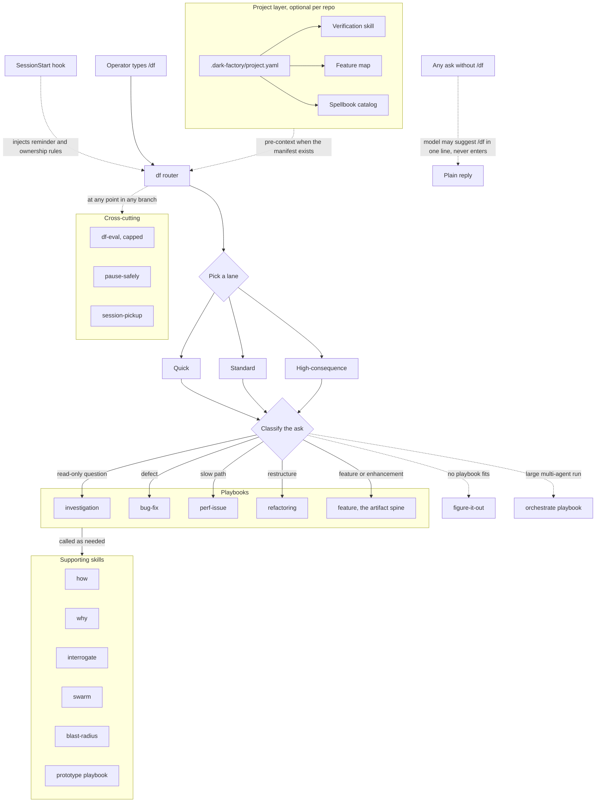
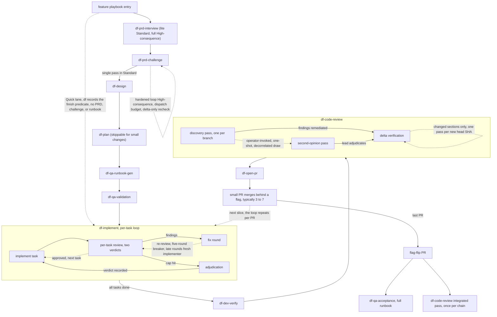
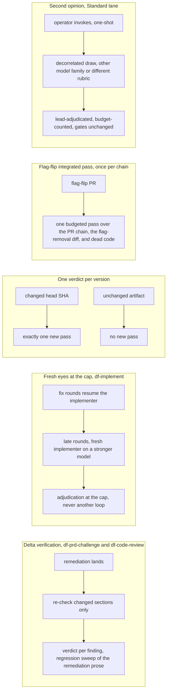

# Dark Factory v2 flow diagrams

Drawn from `docs/2026-08-27-dark-factory-v2-decision-plan.md`, revision 4. Solid edges are forward flow. Dashed edges mark bounded loops, bypasses, and optional paths, and each loop label names its bound.

## Top-level routing

The df router is the top of the stack, and it is explicit-invocation-only. A SessionStart hook injects a one-line reminder and the ownership rules every session, but entering the mode takes the operator typing /df. The model may suggest /df when a task looks like a playbook match, and never enters on its own. Once entered, the router picks a lane, which sets budgets and ceremony, then classifies the ask into a playbook. The feature playbook is the artifact spine. When the repo carries a `.dark-factory/project.yaml` manifest, the router pulls the verification skill, feature map, and Spellbook catalog into context selection. df-eval, pause-safely, and session-pickup cut across every branch.

## The feature branch in detail

The feature playbook runs the artifact spine end to end. The Quick lane skips the PRD steps and df records the finish predicate instead. Standard runs the challenge as a single pass, and High-consequence runs the hardened loop under the dispatch budget with delta-only rechecks. Implementation works task by task under the five-round breaker. Code review is one discovery pass followed by delta verification, with an operator-invoked one-shot second opinion available in the Standard lane. Delivery is several small PRs merging behind a flag as each goes green, and the flag-flip PR triggers the full acceptance runbook plus the integrated review pass.

## Bounded re-review shapes

The multi-round review loops are gone, but resampling is not, because a review pass is a sample and rerunning it catches real findings. What blew up was the coupling. These are the five re-review forms that survive, each with an explicit bound.

